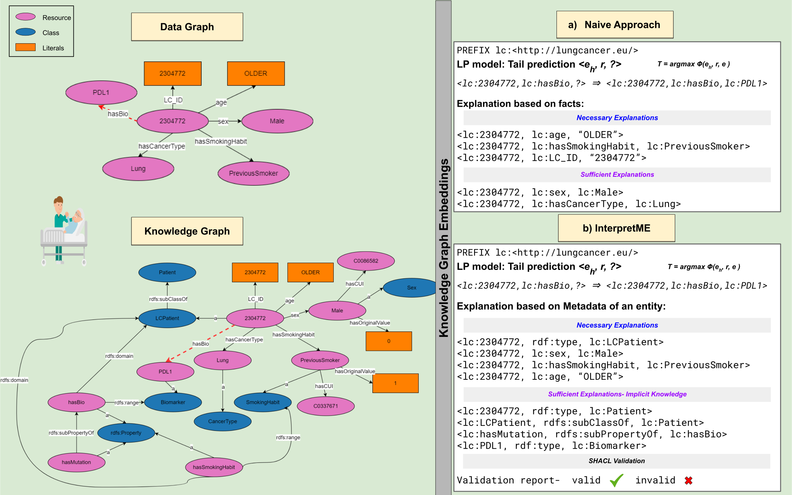

# Exploiting Semantics for Explaining Link Prediction over Knowledge Graphs

## InterpretME
Explainability is the degree to which humans can understand the decisions made by computational frameworks. Out of these machine learning traits, extracting explanations is essential, particularly because they are
often opaque, and the explainability of the outcomes is partially achieved. This repository contains the code for a simple demonstration of the evaluating the link prediction models over KGs.

*Note: The part of embedding module will be integrated in [InterpretME](https://github.com/SDM-TIB/InterpretME).*

In this repository the link prediction task is perfomed on real world benchmark `French Royalty KG`. 
The *French Royalty KG* states the information of about a french royal person, class`dbo:Person` and the relations `dbo:spouse`, `dbo:child`, `dbo:parent` and `dbo:mother` are utilized.
The statistics about the KG in numbers:

| #triples | #entities | #predicates |
|:--------:|:---------:|:-----------:|
|  12560   |   2260    |     15      |

Here the predictive task is link prediction of a tail entity; for instance *<dbo:CharlestheSimple, hasSpouse, dbo:Yes>*. The embedding model i.e., TransE is used to represent the entities and relations into low dimensional vectors. The performed evaluation of tail prediction is stored in `Results`. 

The results section shows the evaulation of the model into subcategory: `LP model` and `InterprtME`. In InterpretME the two explanations: **necessary** and **sufficient** are presented. The necessary shows the evaluation of removing the combination of facts; leads to worsen the score and tail rank.
In sufficient explanations, we use the ontology on top of the extracted necessary explanations, and thus infer new insights. Retrained the model with new facts; leads to change the score and rank better. In the paper we report `Hits@1` as top-1 accuracy, Mean Reciprocal Rank, plausible score and the rank. 

### Getting Started
Clone the repository
```python
git clone https://github.com/SDM-TIB/Semantic_Explanation_over_KGs
```
Install prerequisites
```python
pip install -r requirements.txt
```
To run the experiment
```python
python ./Code/link_prediction_french_royalty.py
```