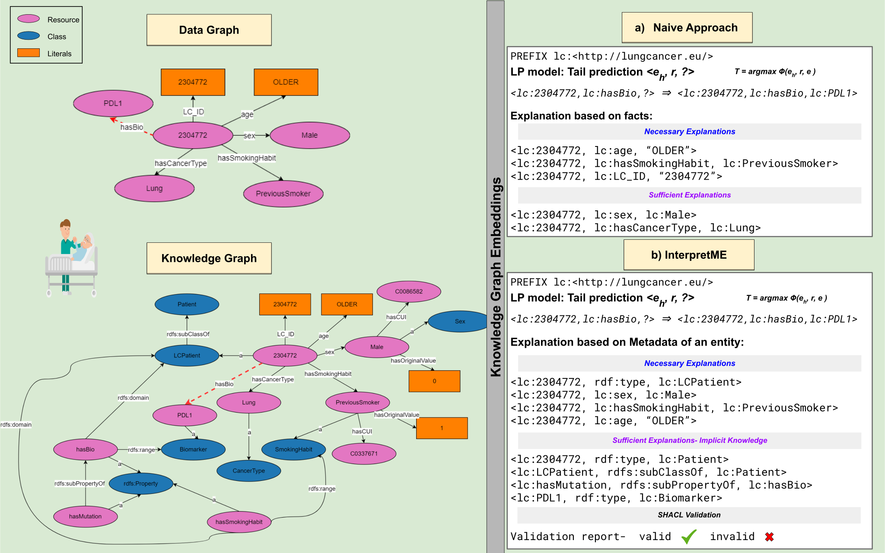

# Exploiting Semantics for Explaining Link Prediction over Knowledge Graphs

## InterpretME
Explainability is the degree to which humans can understand the decisions made by computational frameworks. Out of these machine learning traits, extracting explanations is essential, particularly because they are
often opaque, and the explainability of the outcomes is partially achieved. This repository contains the code for a simple demonstration of the evaluating the link prediction models over KGs.

*Note: The part of embedding module will be integrated in [InterpretME](https://github.com/SDM-TIB/InterpretME).*

In this repository the link prediction task is perfomed on real world benchmark `French Royalty KG`. The results section shows the evaulation of the model into subcategory: `LP model` and `InterprtME`. In InterpretME the two explanations: **necessary** and **sufficient** are presented. The necessary shows the evaluation of removing the combination of facts; leads to worsen the score and tail rank. 
### Getting Started
Clone the repository
```python
 git clone https://github.com/SDM-TIB/Semantic_Explanation_over_KGs
```
Install the required libraries
```python
pip install -r requirements.txt
```
